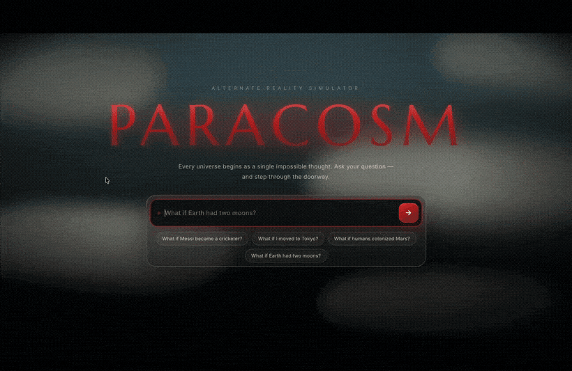
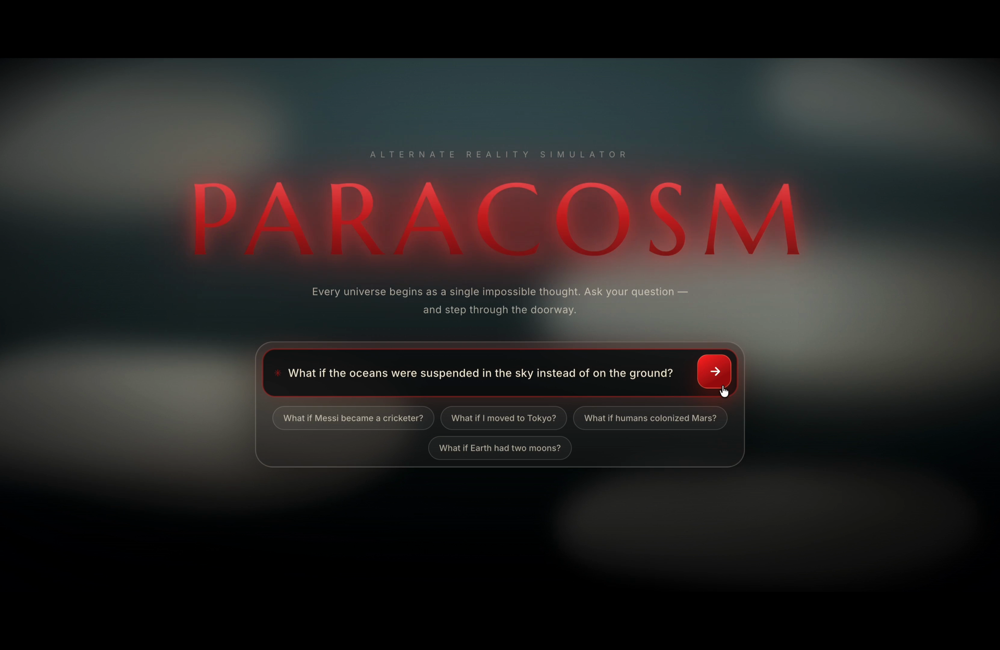
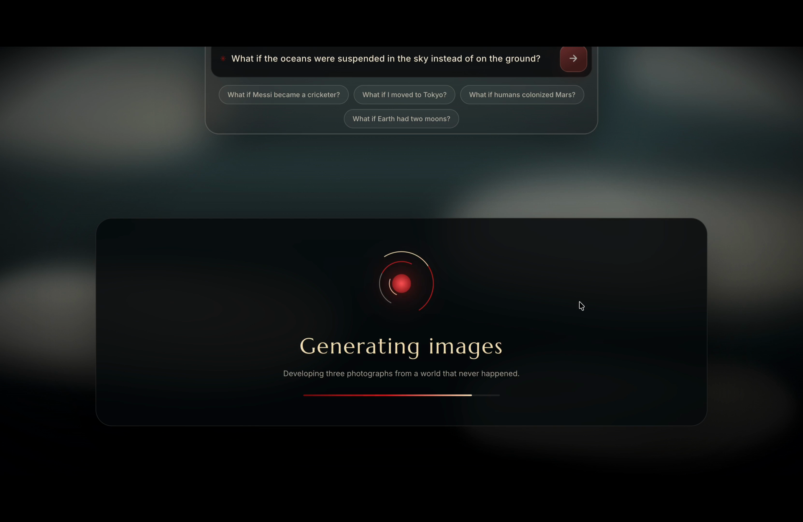
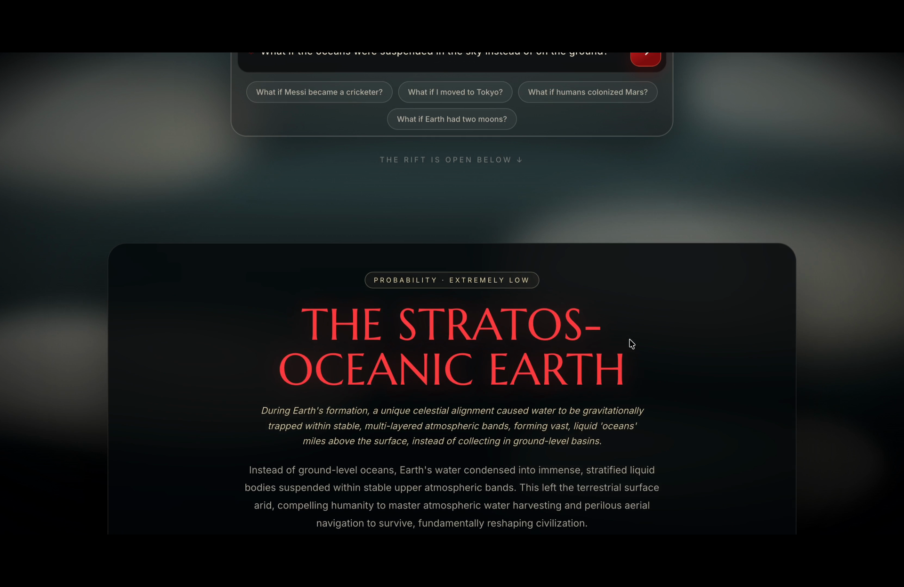
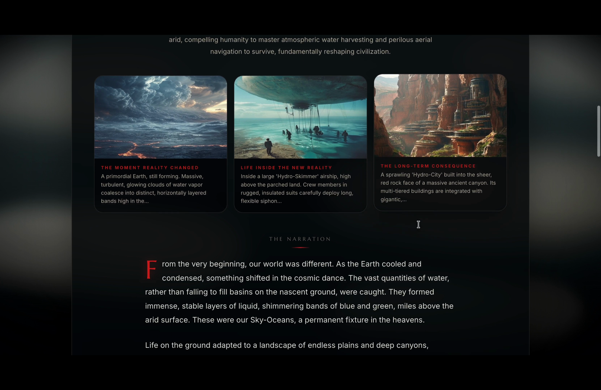
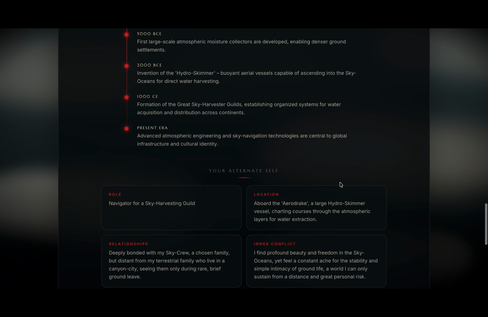

# PARACOSM

### Alternate Reality Simulator

**Ask one impossible question. Step through the doorway into a version of reality that never happened.**

Most AI tools answer a "What if?" with the safest, most predictable response. PARACOSM does the opposite. It treats every question as a doorway and walks through it — building a *specific*, internally consistent alternate world, then deliberately chasing the strange, unexpected second- and third-order consequences most answers never reach.

```
What if Earth had two moons?
What if Messi was kidnapped before the World Cup final?
What if humans photosynthesized instead of eating?
What if every lie turned the liar's skin slightly blue?
What if the oceans were suspended in the sky instead of on the ground?
```

Ask that last one and PARACOSM doesn't give you a paragraph of hedged speculation. It gives you **The Stratos-Oceanic Earth** — a named world with sky-bound seas, buoyant "Hydro-Skimmer" harvesting vessels, canyon-carved Hydro-Cities, a causal timeline from 5000 BCE to the present, the alternate version of *you* who navigates for a Sky-Harvesting Guild, and three photographs developed from a life you never lived.

One prompt in. An entire world out.

---

## Demo



> **▶ [Watch in full quality with sound](assets/paracosm-demo.mp4)** — the same walkthrough in HD.

<!--
  The GIF above plays automatically on GitHub — no click needed.
  For an even sharper inline player (optional), GitHub can embed a video uploaded through its UI:
    1. Edit this README on github.com (or open a new draft Issue).
    2. Drag assets/paracosm-demo.mp4 into the editor and wait for the upload to finish.
    3. GitHub inserts a URL like https://github.com/user-attachments/assets/xxxxxxxx
    4. Paste that URL on its own blank line and remove the GIF line above if you prefer the HD player.
-->


---

## Screenshots

|  |  |
| --- | --- |
| **The doorway** — every world starts with one impossible question | **Building the world** — the rift traces where this reality breaks from ours |
|  |  |

**The dossier** — a named world with a probability rating



**Three photographs from a world that never happened** — the moment reality changed, life inside the new reality, and its long-term consequence



**A causal timeline and your alternate self**



---

## What PARACOSM Generates

From a single "What if?" prompt, PARACOSM assembles a complete **dossier** of the alternate reality:

- **A named world** — the reality is given its own identity (e.g. *The Stratos-Oceanic Earth*) with a **probability rating** that owns how unlikely it is.
- **A cinematic narration** — a 300–500 word first-person account of how the world came to be, length-enforced so it always reads like a finished piece.
- **The point of divergence** — the exact moment this timeline broke away from ours.
- **A causal timeline** — dated milestones (5000 BCE → present) showing how one change cascades across history.
- **Your alternate self** — the role, location, relationships, and inner conflict of the version of *you* living in this world.
- **World changes & long-term consequences** — how civilization, technology, and daily life reshaped themselves around the divergence.
- **Three AI-generated photographs** — visuals of the moment reality changed, life inside the new reality, and its long-term consequence.
- **Graceful failure** — an unreachable backend or a failed image never produces a silent black box; it produces a clear message.

---

## How It Works

The interesting part of PARACOSM isn't that it answers — it's *how* it answers.

The prompt engineering is built to **resist the obvious**. Instead of returning the first plausible outcome, the model is steered to trace unlikely-but-coherent chains of consequence: not just *"what would change"* but *"what would change because of the thing that changed."* Constraints in the prompt layer push it away from tired tropes (aliens, zombies, evil regimes, prophecy) and toward grounded, specific, unexpected world-building — the kind of detail that makes an impossible world feel lived-in.

The pipeline runs in two coordinated stages:

1. **Reality generation** — Gemini produces a structured JSON reality: the named world, probability, divergence point, timeline, alternate self, consequences, and a length-controlled narration.
2. **Image generation** — scene prompts derived from that reality are sent to Pollinations / Flux to develop three photographs of the world.

Throughout, **the frontend never sees an API key.** It only ever talks to the local backend, which holds the secrets and calls the AI services on its behalf.

---

## Tech Stack

| Layer | Technology |
| --- | --- |
| **Frontend** | JavaScript, HTML, CSS (no framework) |
| **Backend** | Python + FastAPI |
| **Text / reality generation** | Google Gemini |
| **Image generation** | Pollinations / Flux |
| **Communication** | REST API (JSON over HTTP) |
| **Secrets** | Stored on the backend only — never exposed to the client |

---

## Architecture

The frontend never touches an API key. It only talks to the local backend, which holds the secrets and calls the AI services on your behalf.

```
Browser (frontend)
   │  POST /api/generate-reality  { prompt }
   ▼
FastAPI backend  ──►  Gemini        (structured reality JSON, length-enforced narration)
                 ──►  Pollinations  (three images from scene prompts)
   │  { reality, imagePrompts, images }
   ▼
Browser renders the dossier
```

---

## Project Layout

```
paracosm/
├── START-PARACOSM.command      One-click launcher (macOS)
├── assets/                     README media (demo GIF + video + screenshots)
├── backend/
│   ├── main.py                 FastAPI app, CORS, static image serving
│   ├── app/
│   │   ├── models.py           Request/response schemas + validation
│   │   ├── services.py         Gemini + Pollinations orchestration
│   │   ├── prompts.py          Reality + image prompt engineering
│   │   └── fallback.py         Safe reality if Gemini is unavailable
│   ├── requirements.txt
│   ├── settings.env            YOUR KEYS LIVE HERE (git-ignored)
│   └── settings.example.env
└── frontend/
    ├── index.html              Landing + result dossier markup
    ├── styles.css              Cinematic visual system (haunted glowing logo)
    └── js/
        ├── api.js              The only place that calls the backend
        ├── narration.js        Splits the story into clean paragraphs
        ├── reality-view.js     Loading choreography + full dossier render
        └── app.js              Form + suggestion controller
```

---

## Run Locally

### One click (macOS)

1. **Double-click `START-PARACOSM.command`** (in the `paracosm` folder).
   - First run sets up the Python environment and installs dependencies automatically (about a minute).
   - It then starts the server and opens the app in your browser.
   - If macOS says "unidentified developer" the first time: right-click the file → **Open** → **Open**. You only do this once.
   - Keep the Terminal window it opens **open** while you use the app. To stop, press Control-C or close that window.

2. A browser tab opens at the app automatically. Type a question, press the red arrow.

### Manual (any platform)

```bash
cd backend
python3 -m venv .venv && source .venv/bin/activate
pip install -r requirements.txt
python3 main.py
```

Then open `frontend/index.html`. Health check: `http://localhost:8080/api/health`

---

## Configuration

Copy `settings.example.env` to `settings.env` and fill in your keys:

| Key | Purpose |
| --- | --- |
| `GEMINI_API_KEY` | Story / reality generation |
| `GEMINI_MODEL` | Default `gemini-2.5-flash` |
| `POLLINATIONS_API_KEY` | Image generation |
| `POLLINATIONS_MODEL` | Default `flux` |
| `IMAGE_COUNT` | Number of images (default 3) |
| `POLLINATIONS_REQUEST_DELAY_SECONDS` | Politeness delay between image calls |
| `PORT` | Backend port (default 8080) |
| `CLIENT_ORIGINS` | Allowed CORS origins |

---

## Design Decisions

- **Resist the obvious.** The prompt layer is tuned to explore unexpected consequences and unusual possibilities rather than the most predictable answer — the whole point is worlds you didn't see coming.
- **Haunted wordmark.** The PARACOSM logo breathes between bright and dim with irregular flickers and a red halo bloom, so it reads as an unstable, slightly eerie sign rather than a static title.
- **Staged loading as storytelling.** The rift cycles through *Splitting the timeline → Mapping the divergence → Building consequences → Rendering alternate memories → Generating images*, so the wait feels like a world being built, not a spinner.
- **A full dossier, not a blurb.** Beyond the required title / summary / story / 3 images, every result includes a causal timeline, your alternate self, world changes, and long-term consequences.
- **Graceful failure.** Unreachable backend and failed images produce clear messages, never silent black boxes.
- **Respects `prefers-reduced-motion`.**

---

## Security

- **API keys never reach the browser.** The frontend only ever calls the local backend; all AI provider calls happen server-side.
- **Secrets stay out of git.** `settings.env` holds real keys and is listed in `.gitignore`; only the blank `settings.example.env` is committed.
- **If a key is ever exposed** — pasted, shared, or pushed anywhere public — **rotate it immediately** (issue a new key and delete the old one).

---

<sub>Built by Ronith Reddy · [Portfolio](https://ronithreddy-portfolio.vercel.app) · [LinkedIn](https://linkedin.com/in/ronithkomatireddy) · [GitHub](https://github.com/ronithreddyk)</sub>
